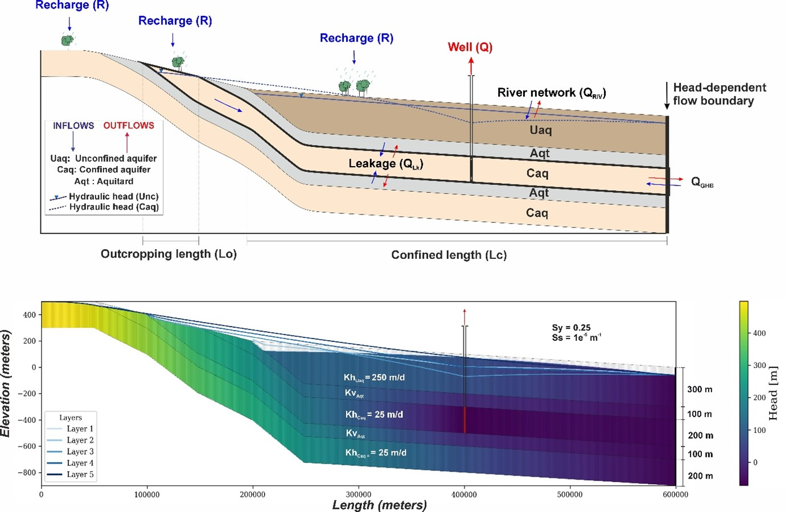

# ConfinedLab

**ConfinedLab** is a modular Python toolkit for generating, simulating, and analyzing synthetic multilayer groundwater flow systems using MODFLOW 6. 
It is designed for research, teaching, and rapid prototyping of conceptual hydrogeological models of confined aquifer systems.

Its primary goal is to investigate the transient response of multilayer aquifer systems to external climatic and anthropogenic forcings by using 
numerical flow models. Furthermore, it aims to assess the implications of response times into past and future behaviour of the system to inform 
approaches for the estimation of sustainable yields.

---

## Features

- **Synthetic Geometry Generation:**  
  Easily create multilayer geometries of synthetic stratigraphic configurations of a sedimentary multilayer system.

- **Flexible Model Setup:**  
  Quickly define model grids, hydraulic properties, boundary conditions, and recharge scenarios.

- **Optimize a pumping scenario**  
  Estimate the sustainable yield based on a constrained optimization approach with user defined constrains and goals.

- **Visualization & Analysis:**  
  Built-in plotting and post-processing tools for heads, flows, budgets, and more.

- **Analyse parameter influence on results:**  
  Investigate the effect of a model parameter on the sustainable yield estimations.


## Example: Creating a Synthetic Model Geometry

```python
from mlibs import modgeom6

# Define synthetic geometry generation parameters
epsilon = 0 # Minimum allowed cell thickness in meters
outcrop_z = np.array([100, 150, 200, 250, 350]) # Elevation (Just used when SLOPE is set to False)
outcrop_zmax = np.array([200, 300, 400, 500, 500]) # Elevation (Just used when SLOPE are set to True)
outcrop_zmin = np.array([0, 200, 300, 400, 500]) # Elevation (Just used when SLOPE are set to True)
base_thicknesses = np.array([300, 150, 200, 150, 200]) # Layer thickness in meters
outcrop_cells = np.array([200, 150, 100, 50, 0]) 
transition = 50 # Number of transitions cells

# Create idomain and geometry arrays
idomain = modgeom6.compute_idomain(nlay, nrow, ncol, outcrop_cells)
ztop = modgeom6.compute_top(idomain, outcrop_z, transition=True, slope=True,
                            transition_cells=transition, transition_type="contain", 
                            outcrop_zmin=outcrop_zmin, outcrop_zmax=outcrop_zmax)
thickness_array = modgeom6.compute_thickness(idomain, base_thicknesses, 
                                             transition=True, transition_type="contain", 
                                             transition_cells=transition)
zbot = modgeom6.compute_bottom(ztop, thickness_array)
```



## Contact

For questions, suggestions, or contributions, please contact:  
Carlos Felipe Marin Rivera  
Bordeaux INP, Lab EPOC, Université de Bordeaux
cmarinriver@bordeaux-inp.fr  

---
